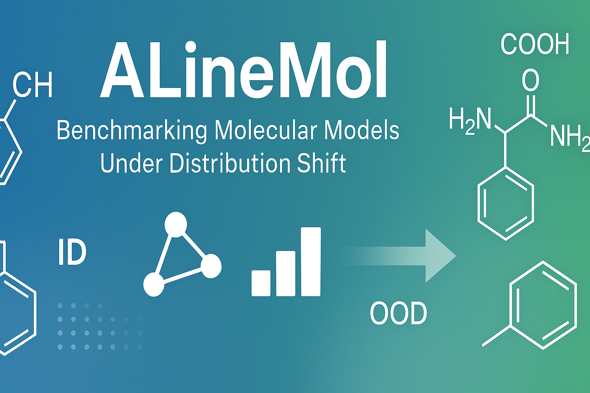

# ALineMol: Evaluating Machine Learning Models for Molecular Property Prediction on OOD Data

[](https://opensource.org/licenses/MIT)
[](https://github.com/HFooladi/ALineMol/actions/workflows/ci.yml)
[](https://doi.org/10.26434/chemrxiv-2025-g1vjf-v2)

<p align="center">
  
</p>

## Overview

**ALineMol** is a comprehensive research framework for evaluating and quantitatively assessing the relationship between machine learning model performance on in-distribution (ID) and out-of-distribution (OOD) data in the molecular domain. This work addresses critical questions in AI-driven drug discovery about model generalization to novel chemical structures.

### Key Contributions

🔬 **Comprehensive Evaluation**: Systematic assessment of ML models (classical ML + GNNs) across multiple datasets using different splitting strategies

📊 **Distribution Shift Analysis**: Quantitative investigation of what constitutes "out-of-distribution" data in molecular property prediction

🎯 **ID-OOD Relationship**: Deep analysis of correlation between in-distribution and out-of-distribution performance across different scenarios

⚗️ **Drug Discovery Focus**: Practical insights for molecular property prediction and bioactivity classification in pharmaceutical research

### Setup

#### Option 1: Using uv (Recommended)

[uv](https://docs.astral.sh/uv/) is a fast Python package installer.

**Quick Install (using script):**
```bash
# Clone the repository
git clone https://github.com/HFooladi/ALineMol.git
cd ALineMol

# Install with CPU (default)
./install.sh

# Or install with CUDA support
./install.sh cu121  # CUDA 12.1
./install.sh cu118  # CUDA 11.8
./install.sh cu124  # CUDA 12.4

# Activate the environment
source .venv/bin/activate
```

**Manual Install:**
```bash
# Install uv
curl -LsSf https://astral.sh/uv/install.sh | sh

# Clone the repository
git clone https://github.com/HFooladi/ALineMol.git
cd ALineMol

# Create virtual environment
uv venv --python 3.11
source .venv/bin/activate  # On Windows: .venv\Scripts\activate

# CPU-only installation
uv pip install -e ".[dev,test]" -f https://download.pytorch.org/whl/cpu -f https://data.dgl.ai/wheels/repo.html

# Or CUDA 12.1 installation
uv pip install -e ".[dev,test]" -f https://download.pytorch.org/whl/cu121 -f https://data.dgl.ai/wheels/repo.html
```

#### Option 2: Using conda

```bash
# Clone the repository
git clone https://github.com/HFooladi/ALineMol.git
cd ALineMol

# Create and activate conda environment
conda env create -f environment.yml
conda activate alinemol

# Install ALineMol package
pip install --no-deps -e .
```

## Quick Start

### Basic Usage

```python
import pandas as pd
from alinemol.preprocessing import standardization_pipeline
from alinemol.splitters import ScaffoldSplit, MolecularWeightSplit
from alinemol.utils import compute_similarities

# Load and preprocess data
df = pd.read_csv("your_dataset.csv")  # Columns: 'smiles', 'label'
df_clean = standardization_pipeline(df)

# Create different types of splits
scaffold_splitter = ScaffoldSplit(test_size=0.2)
weight_splitter = MolecularWeightSplit(test_size=0.2, generalize_to_larger=True)

# Evaluate different splitting strategies
for train_idx, test_idx in scaffold_splitter.split(df_clean['smiles']):
    train_data = df_clean.iloc[train_idx]
    test_data = df_clean.iloc[test_idx]
    
    # Compute molecular similarities
    similarities = compute_similarities(
        train_data['smiles'], 
        test_data['smiles'],
        fingerprint='ecfp',
        fprints_hopts={'radius': 2, 'fpSize': 1024}
    )
    print(f"Average train-test similarity: {similarities.mean():.3f}")
```

### Comprehensive Evaluation Pipeline

```python
from alinemol.utils import load_dataset, split_dataset, compute_ID_OOD
from alinemol.utils.plot_utils import plot_ID_OOD_sns, heatmap_plot

# Evaluate multiple models across different split types
results = compute_ID_OOD(
    dataset_category="TDC",
    dataset_names="CYP2C19", 
    split_type="scaffold",
    num_of_splits=10
)

# Visualize ID vs OOD performance
plot_ID_OOD_sns(results, dataset_name="CYP2C19", save=True)

# Create performance heatmaps
heatmap_plot(results, metric="roc_auc", save=True)
```

## Splitting Strategies

ALineMol provides a unified API for molecular dataset splitting with multiple strategies to simulate different types of distribution shift.

### Factory Function (Recommended)

The easiest way to create splitters is using the `get_splitter()` factory function:

```python
from alinemol.splitters import get_splitter, list_splitters, get_splitter_names

# List all available splitters
print(get_splitter_names())
# ['butina', 'datasail', 'hi', 'kmeans', 'lo', 'max_dissimilarity',
#  'molecular_logp', 'molecular_weight', 'molecular_weight_reverse',
#  'perimeter', 'random', 'scaffold', 'scaffold_generic', 'umap']

# Create a splitter via factory function
splitter = get_splitter("scaffold", make_generic=True, n_splits=5, test_size=0.2)

# Use with SMILES directly
smiles = ["CCO", "c1ccccc1", "CCN", ...]
for train_idx, test_idx in splitter.split(smiles):
    train_smiles = [smiles[i] for i in train_idx]
    test_smiles = [smiles[i] for i in test_idx]
```

### 1. Structure-Based Splits
```python
from alinemol.splitters import get_splitter, ScaffoldSplit, PerimeterSplit

# Bemis-Murcko scaffold splitting (via factory)
scaffold_split = get_splitter("scaffold", make_generic=True)

# Or direct class instantiation
scaffold_split = ScaffoldSplit(make_generic=True)

# Perimeter-based clustering
perimeter_split = get_splitter("perimeter", n_clusters=10)
```

### 2. Property-Based Splits
```python
from alinemol.splitters import get_splitter, MolecularWeightSplit, MolecularLogPSplit

# Split by molecular weight (test on larger molecules)
mw_split = get_splitter("molecular_weight", generalize_to_larger=True)

# Split by lipophilicity
logp_split = get_splitter("molecular_logp", generalize_to_larger=True)
```

### 3. Similarity-Based Splits
```python
from alinemol.splitters import get_splitter, HiSplit, LoSplit

# Hi-split: ensures low similarity between train/test
hi_split = get_splitter("hi",
    similarity_threshold=0.4,
    train_min_frac=0.7,
    test_min_frac=0.15
)

# Lo-split: for lead optimization scenarios
lo_split = get_splitter("lo",
    threshold=0.4,
    min_cluster_size=5,
    std_threshold=0.6
)
```

### 4. Clustering-Based Splits
```python
from alinemol.splitters import get_splitter, UMAPSplit, KMeansSplit

# UMAP + clustering split
umap_split = get_splitter("umap",
    n_clusters=20,
    n_neighbors=100,
    min_dist=0.1
)

# K-means clustering split
kmeans_split = get_splitter("kmeans", n_clusters=10, metric="jaccard")

# Butina clustering (Taylor-Butina algorithm)
butina_split = get_splitter("butina", cutoff=0.65)
```

### Command-Line Splitting Tool

ALineMol includes a production-ready CLI tool for dataset splitting:

```bash
# Basic scaffold splitting
python scripts/splitting.py -f data/molecules.csv -sp scaffold --save

# Run all splitters at once
python scripts/splitting.py -f data/molecules.csv -sp all --save

# Preview without saving (dry run)
python scripts/splitting.py -f data/molecules.csv -sp kmeans --dry-run

# List available splitters
python scripts/splitting.py --list-splitters
```

## Development

### Tests

Run the test suite with pytest:

```bash
pytest
```

### Code Style

We use `ruff` for linting and formatting:

```bash
# Check code style
ruff check

# Format code
ruff format
```

### Documentation

Build and serve the documentation locally:

```bash
mkdocs serve
```

### Continuous Integration

This project uses GitHub Actions for continuous integration and deployment:

- **CI Workflow**: Automatically runs tests and linting on all pull requests and pushes to the main branch
- **Release Workflow**: Automatically builds and publishes the package to PyPI when a new release is created

To create a new release:

1. Update the version in `_version.py`
2. Create a new tag and GitHub release
3. The release workflow will automatically publish to PyPI

## Citation

If you find ALineMol useful in your research, please cite the following paper:

```bibtex
@article{fooladi2025evaluating,
  title={Evaluating Machine Learning Models for Molecular Property Prediction: Performance and Robustness on Out-of-Distribution Data},
  author={Fooladi, Hosein and Vu, Thi Ngoc Lan and Kirchmair, Johannes},
  year={2025},
  doi = {https://doi.org/10.26434/chemrxiv-2025-g1vjf-v2}
}
```

## Related Work

- **Splito**: Molecular splitting library - [GitHub](https://github.com/datamol-io/splito)
- **TDC**: Therapeutics Data Commons - [Website](https://tdcommons.ai/)
- **DGL-LifeSci**: Deep Graph Library for Life Sciences - [GitHub](https://github.com/awslabs/dgl-lifesci)

## Documentation

- 📖 [Full Documentation](docs/)
- 📝 [API Reference](docs/api/)
- 🎓 [Tutorials](docs/tutorials/)
- 📊 [Paper](https://doi.org/10.26434/chemrxiv-2025-g1vjf-v2)

## Contributing

We welcome contributions! Please see our [Contributing Guidelines](CONTRIBUTING.md) for details on:
- Reporting bugs
- Suggesting enhancements  
- Submitting pull requests
- Code style guidelines

## License

This project is licensed under the MIT License - see the [LICENSE](LICENSE) file for details.
