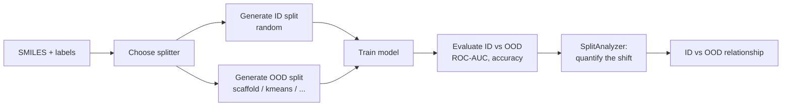
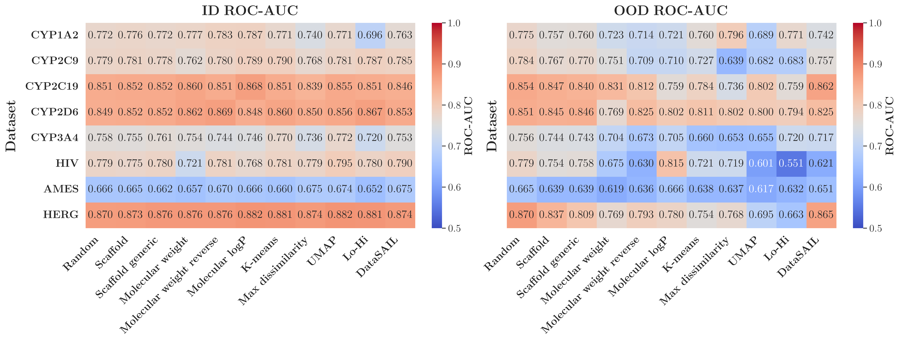
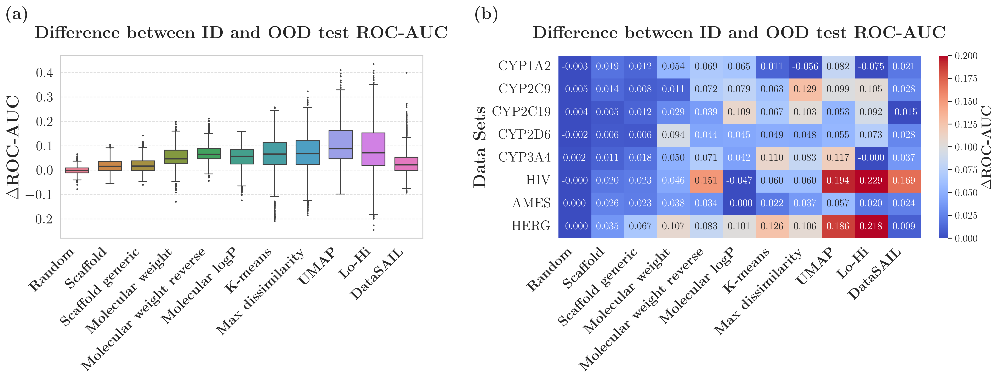

# Out-of-Distribution Evaluation

Machine learning models for molecular property prediction are usually validated
on a **random split** of the available data. This measures *in-distribution*
(ID) performance — how well the model does on molecules drawn from the same
distribution it was trained on. But models are deployed on **new chemistry**:
scaffolds, size ranges, and regions of chemical space that were absent (or rare)
at training time. That is the *out-of-distribution* (OOD) regime, and it is where
generalization actually matters for drug discovery.

ALineMol is built to measure the gap between ID and OOD performance in a
**rigorous and reproducible** way.

## What "out-of-distribution" means for molecules

Unlike images or text, molecules do not have a single obvious notion of
distribution shift. ALineMol operationalizes several complementary notions, each
realized by a family of [splitters](splitting-strategies.md):

- **Structural shift** — the test set contains scaffolds or substructures unseen
  in training (`scaffold`, `butina`).
- **Property shift** — the test set differs systematically in a physicochemical
  property such as molecular weight or lipophilicity (`molecular_weight`,
  `molecular_logp`).
- **Chemical-space shift** — training and test sets occupy different clusters of
  a fingerprint/embedding space (`kmeans`, `umap`, `max_dissimilarity`,
  `perimeter`).
- **Similarity-controlled shift** — the maximum train↔test similarity is bounded,
  as in lead-optimization scenarios (`hi`, `lo`).

The `random` splitter provides the ID reference point against which every OOD
splitter is compared.

## The evaluation workflow

1. **Split** the dataset with both a random (ID) splitter and one or more OOD
   splitters.
2. **Train** the same model on each training partition — classical ML
   ([`CML`](../api/models.md)) or a GNN ([`FragGNN`](../api/models.md)).
3. **Evaluate** on the corresponding test partitions with metrics from
   [`alinemol.utils`](../api/utils.md) (`eval_roc_auc`, `eval_acc`, …).
4. **Quantify** the actual shift each split produced with
   [`SplitAnalyzer`](split-analysis.md), so the OOD label is validated, not
   assumed.
5. **Relate** ID to OOD performance across models, datasets, and splitters —
   the *accuracy-on-the-line* and *agreement-on-the-line* analysis described in
   [Agreement-on-the-Line](agreement-on-the-line.md).

## Reading the results

Systematic ID vs OOD comparison across datasets typically reveals a consistent
**generalization gap** — OOD ROC-AUC sits below ID ROC-AUC, with the size of the
gap depending on the splitter and the model family.

<figure markdown>
  { width="720" }
  <figcaption>ID vs OOD ROC-AUC across models and datasets. The OOD columns are
  systematically lower than their ID counterparts.</figcaption>
</figure>

<figure markdown>
  { width="720" }
  <figcaption>Distribution of the ID→OOD performance drop, aggregated over
  datasets and splitting strategies.</figcaption>
</figure>

## Next steps

- [Splitting Strategies](splitting-strategies.md) — pick the shift you want to
  test.
- [Split Quality Analysis](split-analysis.md) — prove your split is OOD.
- [Agreement-on-the-Line](agreement-on-the-line.md) — the ID↔OOD relationship at
  the heart of the paper.
