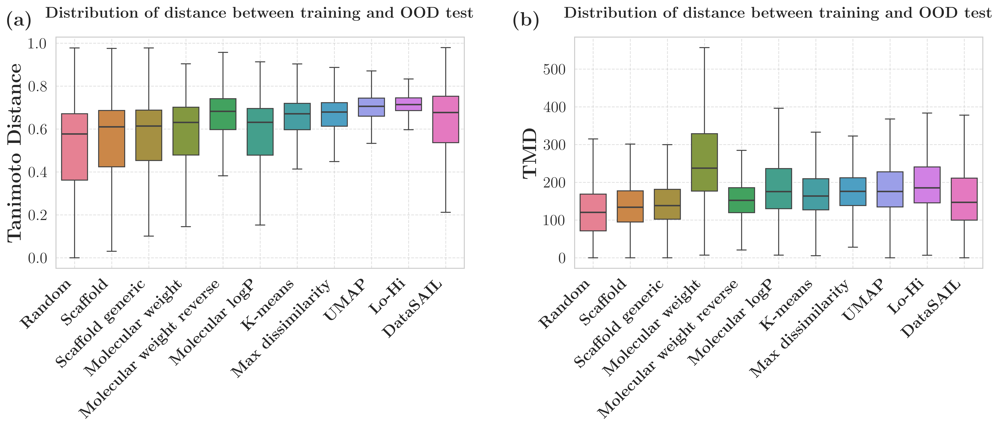

# Split Quality Analysis

A splitter's *name* tells you what kind of shift it is *supposed* to produce. The
[`SplitAnalyzer`](../api/splitters.md#alinemol.splitters.analyzer.SplitAnalyzer)
tells you what shift it *actually* produced. Use it to validate that an "OOD"
split is genuinely more dissimilar than the random baseline — and to compare
splitters quantitatively.

`SplitAnalyzer` reports, for any train/test partition:

- **Similarity metrics** — the distribution of train↔test Tanimoto similarity.
- **Scaffold metrics** — scaffold overlap between train and test.
- **Property distribution** — divergence of physicochemical properties.
- **Size metrics** — basic partition-size sanity checks.

## Basic usage

```python
from alinemol.splitters import SplitAnalyzer, get_splitter

analyzer = SplitAnalyzer(smiles_list)

# Analyze a single split
splitter = get_splitter("scaffold")
train_idx, test_idx = next(splitter.split(smiles_list))
report = analyzer.analyze_split(train_idx, test_idx, splitter_name="scaffold")

print(f"Mean train-test similarity: {report.similarity_metrics.mean_sim:.3f}")
print(f"Scaffold overlap:           {report.scaffold_metrics.scaffold_overlap_percentage:.1f}%")
```

## Comparing splitters

```python
# One row per splitter, ready to sort or plot
comparison = analyzer.compare_splitters(["random", "scaffold", "kmeans"])
print(comparison)
```

A well-behaved OOD splitter should show **lower** mean similarity and **lower**
scaffold overlap than `random`.

<figure markdown>
  { width="640" }
  <figcaption>Train↔test distance distributions differ markedly between random
  and structure-based splits.</figcaption>
</figure>

## Reusing a precomputed Jaccard distance matrix

For studies that sweep many splitter × seed combinations on the same dataset,
recomputing pairwise Tanimoto similarity inside every `analyze_split` call is the
dominant cost. `SplitAnalyzer` can consume a precomputed pairwise **Jaccard
distance matrix** and slice into it instead:

```python
import numpy as np
from alinemol.splitters import SplitAnalyzer

# Either pass a path to an .npy file (loaded with mmap)...
analyzer = SplitAnalyzer(
    smiles_list,
    precomputed_distance_matrix="datasets/TDC/CYP2C9/Jaccard_distance.npy",
)

# ...or pass the array directly.
distance = np.load("datasets/TDC/CYP2C9/Jaccard_distance.npy")
analyzer = SplitAnalyzer(smiles_list, precomputed_distance_matrix=distance)
```

!!! warning "SMILES order must match the matrix"
    The matrix rows/columns are indexed by the same integer positions as the
    SMILES list passed to `SplitAnalyzer`. Use
    `datasets/TDC/<NAME>/valid_canonical_smiles.txt` (the SMILES list the matrix
    was built from) in the same order. The CLI helper
    `scripts/analyze_splits.py:resolve_precomputed_distance` auto-detects and
    validates this alignment.

The precomputed `Jaccard_distance.npy` files shipped with each TDC dataset use
Morgan radius=2, 2048-bit fingerprints — the default `SplitAnalyzer` fingerprint
configuration. (Splitter *clustering*, by contrast, uses 1024-bit ECFP to
preserve the cluster boundaries of the published splits.)

## Command-line analysis

```bash
# Analyze and compare splitters for a dataset from the terminal
python scripts/analyze_splits.py --help
```

See the [Splitters API](../api/splitters.md) for the full `SplitAnalyzer`
signature and the dataclasses it returns (`SplitQualityReport`,
`SimilarityMetrics`, `ScaffoldMetrics`, `PropertyDistribution`, `SizeMetrics`).
