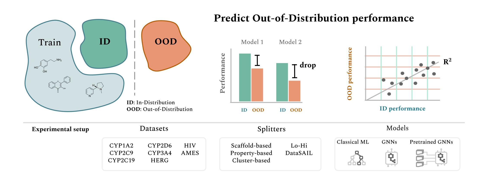

---
hide:
  - navigation
  - toc
---

<p align="center">
  
</p>

<p align="center">
  <a href="https://opensource.org/licenses/MIT"></a>
  <a href="https://github.com/HFooladi/ALineMol/actions/workflows/ci.yml"></a>
  <a href="https://doi.org/10.1021/acs.jcim.5c00475"></a>
  <a href="https://colab.research.google.com/github/HFooladi/ALineMol/blob/main/notebooks/exploratory/colab_splitter_quickstart.ipynb"></a>
</p>

<p align="center" style="font-size: 1.15rem;">
  <strong>Does in-distribution accuracy predict out-of-distribution accuracy for molecular models?</strong><br>
  ALineMol helps you find out — with rigorous, reproducible distribution-shift evaluation for molecular property and activity prediction.
</p>

<p align="center">
  <a href="getting-started/installation.html" class="md-button md-button--primary">Get started</a>
  <a href="getting-started/quickstart.html" class="md-button">Quickstart</a>
  <a href="https://github.com/HFooladi/ALineMol" class="md-button">GitHub</a>
</p>

---

## Why ALineMol?

Molecular ML models are usually reported by their **in-distribution (ID)** accuracy — performance on a random test split. But in real drug discovery you deploy them on **novel chemistry**: new scaffolds, larger molecules, unexplored regions of chemical space. ALineMol makes it easy to measure how well ID performance transfers to these **out-of-distribution (OOD)** settings, and to study the *agreement-on-the-line* and *accuracy-on-the-line* phenomena for molecules.

<div class="grid cards" markdown>

-   :material-scatter-plot:{ .lg .middle } &nbsp; **16 splitting strategies**

    ---

    Structure-, property-, clustering-, and similarity-based splitters behind one
    SMILES-first API. Generate realistic distribution shift with a single line.

    [:octicons-arrow-right-24: Splitting strategies](guide/splitting-strategies.md)

-   :material-chart-bell-curve-cumulative:{ .lg .middle } &nbsp; **OOD evaluation**

    ---

    Benchmark classical ML and graph neural networks on ID vs OOD data and
    quantify the generalization gap across datasets and models.

    [:octicons-arrow-right-24: OOD evaluation](guide/ood-evaluation.md)

-   :material-magnify-scan:{ .lg .middle } &nbsp; **Split quality analysis**

    ---

    `SplitAnalyzer` measures train↔test similarity, scaffold overlap, and
    property divergence — so you can prove an "OOD" split is actually OOD.

    [:octicons-arrow-right-24: Split analysis](guide/split-analysis.md)

-   :material-notebook-outline:{ .lg .middle } &nbsp; **Runnable tutorials**

    ---

    Colab-ready notebooks that take you from raw SMILES to a full ID/OOD
    comparison in minutes.

    [:octicons-arrow-right-24: Tutorials](tutorials/index.md)

</div>

## A quick taste

```python
from alinemol.splitters import get_splitter, SplitAnalyzer

smiles = ["CCO", "c1ccccc1", "CCN", "CC(=O)O", "c1ccncc1"]  # your dataset

# 1. Create an OOD split (Bemis-Murcko scaffold split)
splitter = get_splitter("scaffold", n_splits=5, test_size=0.2)
train_idx, test_idx = next(splitter.split(smiles))

# 2. Verify it is actually a distribution shift
analyzer = SplitAnalyzer(smiles)
report = analyzer.analyze_split(train_idx, test_idx, splitter_name="scaffold")
print(f"Mean train-test similarity: {report.similarity_metrics.mean_sim:.3f}")
```

## Citation

If ALineMol is useful in your research, please cite the accompanying paper:

```bibtex
@article{fooladi2025alinemol,
  title   = {Evaluating Machine Learning Models for Molecular Property
             Prediction on Out-of-Distribution Data},
  author  = {Fooladi, Hosein and colleagues},
  journal = {Journal of Chemical Information and Modeling},
  year    = {2025},
  doi     = {10.1021/acs.jcim.5c00475}
}
```
